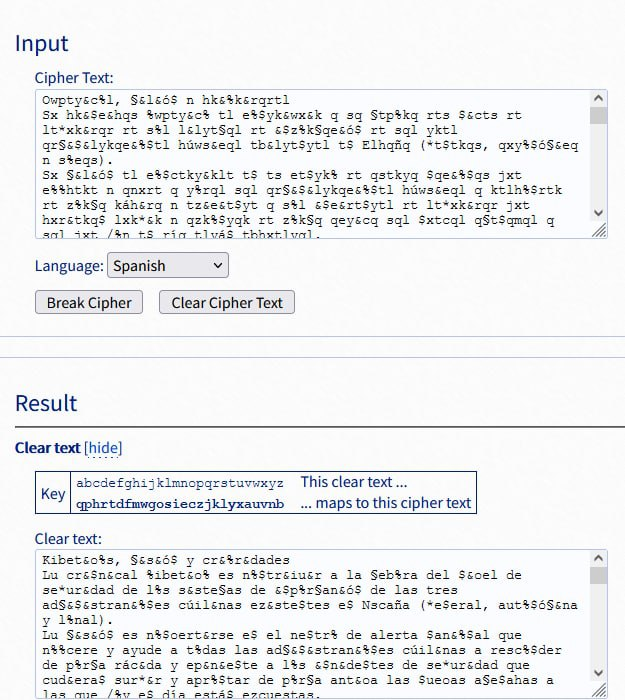

This challenge provides us with the following text to decrypt, along with a clue stating that "each char is ALWAYS replaced by a certain char".

>Owpty&c%l, §&l&ó$ n hk&%k&rqrtl
>Sx hk&$e&hqs %wpty&c% tl e%$yk&wx&k q sq §tp%kq rts $&cts rt lt*xk&rqr rt s%l l&lyt§ql rt &$z%k§qe&ó$ rt sql yktl qr§&$&lykqe&%$tl húws&eql tb&lyt$ytl t$ Elhqñq >(*t$tkqs, qxy%$ó§&eq n s%eqs).
>Sx §&l&ó$ tl e%$ctky&klt t$ ts et$yk% rt qstkyq $qe&%$qs jxt e%%htkt n qnxrt q y%rql sql qr§&$&lykqe&%$tl húws&eql q ktlh%$rtk rt z%k§q káh&rq n tz&e&t$yt q s%l &>$e&rt$ytl rt lt*xk&rqr jxt hxr&tkq$ lxk*&k n qzk%$yqk rt z%k§q qey&cq sql $xtcql q§t$qmql q sql jxt /%n t$ ríq tlyá$ tbhxtlyql.
>Pqkq e%$yk&wx&k q tlyq §tp%kq rts $&cts rt lt*xk&rqr, ts CCN-CERT %zktet lxl ltkc&e&%l q y%r%l s%l ktlh%$lqwstl rt Tte$%s%*íql rt sq I$z%k§qe&ó$ rt sql r&ztkt$ytl >qr§&$&lykqe&%$tl húws&eql q ykqcél rt e&$e% *kq$rtl sí$tql rt qeyxqe&ó$:
>S%h%kyt n e%%kr&$qe&ó$ hqkq ts ykqyq§&t$y% rt cxs$tkqw&s&rqrtl n sq ktl%sxe&ó$ rt &$e&rt$ytl rt lt*xk&rqr jxt yt$*q$ sq Ar§&$&lykqe&ó$ Gt$tkqs rts Elyqr%, sql qr§&>$&lykqe&%$tl rt sql e%§x$&rqrtl qxyó$%§ql, sql t$y&rqrtl jxt &$yt*kq$ sq Ar§&$&lykqe&ó$ L%eqs n sql E$y&rqrtl rt Dtkte/% húws&e% e%$ htkl%$qs&rqr pxkír&eq hk%h&q c&>$exsqrql % rtht$r&t$ytl rt exqsjx&tkq rt sql qr§&$&lykqe&%$tl &$r&eqrql. Es CCN-CERT, q ykqcél rt lx ltkc&e&% rt qh%n% yée$&e% n rt e%%kr&$qe&ó$, qeyxqká e%$ sq >§áb&§q etstk&rqr q$yt exqsjx&tk q*ktl&ó$ kte&w&rq t$ s%l l&lyt§ql rt &$z%k§qe&ó$ rt sql qr§&$&lykqe&%$tl húws&eql. Pqkq ts ex§hs&§&t$y% rt s%l z&$tl &$r&eqr%l t$ >s%l hákkqz%l q$ytk&%ktl lt h%rká$ kteqwqk s%l &$z%k§tl rt qxr&y%kíq rt s%l l&lyt§ql qzteyqr%l.
>Fts&e&rqrtl, yx q$l&qr% ytl%k% tl: zsq*{t53z00w7124266z8et045t27q873220t}
>I$ctly&*qe&ó$ n r&cxs*qe&ó$ rt sql §tp%ktl hkáey&eql l%wkt lt*xk&rqr rtsq &$z%k§qe&ó$ t$ykt y%r%l s%l §&t§wk%l rt sql qr§&$&lykqe&%$tl húws&eql. C%$ tlyq z&$qs&>rqr, sql ltk&tl rt r%ex§t$y%l CCN-STIC %zktetká$ $%k§ql, &$lykxee&%$tl, *xíql n kte%§t$rqe&%$tl hqkq qhs&eqk ts ENS n hqkq*qkq$y&mqk sq lt*xk&rqr rt s%l l&lyt§ql >rt Tte$%s%*íql rt sq I$z%k§qe&ó$ t$ sq Ar§&$&lykqe&ó$.
>F%k§qe&ó$ rtly&$qrq qs htkl%$qs rt sq Ar§&$&lykqe&ó$ tlhte&qs&lyq t$ ts eq§h% rt sq lt*xk&rqr TIC, qs %wpty% rt zqe&s&yqk sq qeyxqs&mqe&ó$ rt e%$%e&§&t$y%l n rt >s%*kqk sq lt$l&w&s&mqe&ó$ n §tp%kq rt lxl eqhqe&rqrtl hqkq sq rtytee&ó$ n *tly&ó$ rt &$e&rt$ytl.
>I$z%k§qe&ó$ l%wkt cxs$tkqw&s&rqrtl, qstkyql n qc&l%l rt $xtcql q§t$qmql q s%l l&lyt§ql rt &$z%k§qe&ó$, kte%h&sqrql rt r&ctklql zxt$ytl rt kte%$%e&r% hktly&*&%, &>$esx&rql sql hk%h&ql.
>I§hxsl% rt $xtcql eqhqe&rqrtl rt ktlhxtlyq q &$e&rt$ytl t$ sql AAPP. Es CCN rtlqkk%ssqká x$ hk%*kq§q jxt %zktmeq sq &$z%k§qe&ó$, z%k§qe&ó$, kte%§t$rqe&%$tl n />tkkq§&t$yql $tetlqk&ql hqkq jxt sql qr§&$&lykqe&%$tl húws&eql hxtrq$ rtlqkk%ssqk lxl hk%h&ql eqhqe&rqrtl rt ktlhxtlyq q &$e&rt$ytl rt lt*xk&rqr.

Examining the text already gives us some interesting findings:
* There are special chars such as comma (,) and dot (.) that fit what would be a regular text.
* It seems that the whitespaces from the original message are left unchanged.
* There is an special fragment that matches the flag pattern: zsq*{t53z00w7124266z8et045t27q873220t}

Algorithms that maintain the original text form are usually quite documented and relatively easy to crack. This time, the clue leaves no doubt about what algorithm has been employed to encrypt this text: __Monoalphabetic substitution__.

This algorithm substitutes each alphabet letter with another alphabet letter, being consistent along substitutions. This is, if a=k at any place in the text, "a" will be replaced by "k" all along. It is different from Cesar cipher because the distance of the original and ciphered letter is not always the same. It is also different to Vignère algorithm because this one is polialphabetic, this is, "a" could be replaced by "k" and then by "j" in different places along the text.

I decided to find a "known plain text" section and build the key from that point. The most confirmed piece of text is the flag one:
zsq*{t53z00w7124266z8et045t27q873220t}

This piece of text tells us that:
* z = f
* s = l
* q = a
* * = g

and also, that we are mostly interested in the equivalence of:
* t = ?
* z = f
* w = ?
* e = ?
* q = a

We will save this note for later.

To speed up the process, I used an online Monoalphabetic substitution algorithm cracker, which analyzes language (this time, assumed Spanish) characteristics in order to statistically determine the most likely key. Although I used the one in https://www.guballa.de/substitution-solver, any similar tool should be enough to obtain an starting point.



This tool gave me the key _qphrtdfmwgosieczjklyxauvnb_ (q = a, p = b...) that I used to build an initial script:
```python
import base64
# Encoded message
original_b64 = "T3dwdHkmYyVsLCCnJmwm8yQgbiBoayYlayZycXJ0bApTeCBoayYkZSZocXMgJXdwdHkmYyUgdGwgZSUkeWsmd3gmayBxIHNxIKd0cCVrcSBydHMgJCZjdHMgcnQgbHQqeGsmcnFyIHJ0IHMlbCBsJmx5dKdxbCBydCAmJHola6dxZSbzJCBydCBzcWwgeWt0bCBxcqcmJCZseWtxZSYlJHRsIGj6d3MmZXFsIHRiJmx5dCR5dGwgdCQgRWxocfFxICgqdCR0a3FzLCBxeHklJPOnJmVxIG4gcyVlcXMpLgpTeCCnJmwm8yQgdGwgZSUkY3RreSZrbHQgdCQgdHMgZXQkeWslIHJ0IHFzdGt5cSAkcWUmJSRxcyBqeHQgZSUlaHRrdCBuIHFueHJ0IHEgeSVycWwgc3FsIHFypyYkJmx5a3FlJiUkdGwgaPp3cyZlcWwgcSBrdGxoJSRydGsgcnQgeiVrp3Ega+FoJnJxIG4gdHomZSZ0JHl0IHEgcyVsICYkZSZydCR5dGwgcnQgbHQqeGsmcnFyIGp4dCBoeHImdGtxJCBseGsqJmsgbiBxemslJHlxayBydCB6JWuncSBxZXkmY3Egc3FsICR4dGNxbCBxp3QkcW1xbCBxIHNxbCBqeHQgLyVuIHQkIHLtcSB0bHnhJCB0Ymh4dGx5cWwuClBxa3EgZSUkeWsmd3gmayBxIHRseXEgp3RwJWtxIHJ0cyAkJmN0cyBydCBsdCp4ayZycXIsIHRzIENDTi1DRVJUICV6a3RldCBseGwgbHRrYyZlJiVsIHEgeSVyJWwgcyVsIGt0bGglJGxxd3N0bCBydCBUdGUkJXMlKu1xbCBydCBzcSBJJHola6dxZSbzJCBydCBzcWwgciZ6dGt0JHl0bCBxcqcmJCZseWtxZSYlJHRsIGj6d3MmZXFsIHEgeWtxY+lsIHJ0IGUmJGUlICprcSRydGwgc+0kdHFsIHJ0IHFleXhxZSbzJDoKUyVoJWt5dCBuIGUlJWtyJiRxZSbzJCBocWtxIHRzIHlrcXlxpyZ0JHklIHJ0IGN4cyR0a3F3JnMmcnFydGwgbiBzcSBrdGwlc3hlJvMkIHJ0ICYkZSZydCR5dGwgcnQgbHQqeGsmcnFyIGp4dCB5dCQqcSQgc3EgQXKnJiQmbHlrcWUm8yQgR3QkdGtxcyBydHMgRWx5cXIlLCBzcWwgcXKnJiQmbHlrcWUmJSR0bCBydCBzcWwgZSWneCQmcnFydGwgcXh58yQlp3FsLCBzcWwgdCR5JnJxcnRsIGp4dCAmJHl0KmtxJCBzcSBBcqcmJCZseWtxZSbzJCBMJWVxcyBuIHNxbCBFJHkmcnFydGwgcnQgRHRrdGUvJSBo+ndzJmUlIGUlJCBodGtsJSRxcyZycXIgcHhr7XImZXEgaGslaCZxIGMmJGV4c3FycWwgJSBydGh0JHImdCR5dGwgcnQgZXhxc2p4JnRrcSBydCBzcWwgcXKnJiQmbHlrcWUmJSR0bCAmJHImZXFycWwuIEVzIENDTi1DRVJULCBxIHlrcWPpbCBydCBseCBsdGtjJmUmJSBydCBxaCVuJSB56WUkJmUlIG4gcnQgZSUla3ImJHFlJvMkLCBxZXl4cWvhIGUlJCBzcSCn4WImp3EgZXRzdGsmcnFyIHEkeXQgZXhxc2p4JnRrIHEqa3RsJvMkIGt0ZSZ3JnJxIHQkIHMlbCBsJmx5dKdxbCBydCAmJHola6dxZSbzJCBydCBzcWwgcXKnJiQmbHlrcWUmJSR0bCBo+ndzJmVxbC4gUHFrcSB0cyBleKdocyanJnQkeSUgcnQgcyVsIHomJHRsICYkciZlcXIlbCB0JCBzJWwgaOFra3F6JWwgcSR5dGsmJWt0bCBsdCBoJXJr4SQga3RlcXdxayBzJWwgJiR6JWundGwgcnQgcXhyJnkla+1xIHJ0IHMlbCBsJmx5dKdxbCBxenRleXFyJWwuCkZ0cyZlJnJxcnRsLCB5eCBxJGwmcXIlIHl0bCVrJSB0bDogenNxKnt0NTN6MDB3NzEyNDI2Nno4ZXQwNDV0MjdxODczMjIwdH0KSSRjdGx5JipxZSbzJCBuIHImY3hzKnFlJvMkIHJ0IHNxbCCndHAla3RsIGhr4WV5JmVxbCBsJXdrdCBsdCp4ayZycXIgcnRzcSAmJHola6dxZSbzJCB0JHlrdCB5JXIlbCBzJWwgpyZ0p3drJWwgcnQgc3FsIHFypyYkJmx5a3FlJiUkdGwgaPp3cyZlcWwuIEMlJCB0bHlxIHomJHFzJnJxciwgc3FsIGx0ayZ0bCBydCByJWV4p3QkeSVsIENDTi1TVElDICV6a3RldGvhJCAkJWuncWwsICYkbHlreGVlJiUkdGwsICp47XFsIG4ga3RlJad0JHJxZSYlJHRsIGhxa3EgcWhzJmVxayB0cyBFTlMgbiBocWtxKnFrcSR5Jm1xayBzcSBsdCp4ayZycXIgcnQgcyVsIGwmbHl0p3FsIHJ0IFR0ZSQlcyUq7XFsIHJ0IHNxIEkkeiVrp3FlJvMkIHQkIHNxIEFypyYkJmx5a3FlJvMkLgpGJWuncWUm8yQgcnRseSYkcXJxIHFzIGh0a2wlJHFzIHJ0IHNxIEFypyYkJmx5a3FlJvMkIHRsaHRlJnFzJmx5cSB0JCB0cyBlcadoJSBydCBzcSBsdCp4ayZycXIgVElDLCBxcyAld3B0eSUgcnQgenFlJnMmeXFrIHNxIHFleXhxcyZtcWUm8yQgcnQgZSUkJWUmpyZ0JHklbCBuIHJ0IHMlKmtxayBzcSBsdCRsJncmcyZtcWUm8yQgbiCndHAla3EgcnQgbHhsIGVxaHFlJnJxcnRsIGhxa3Egc3EgcnR5dGVlJvMkIG4gKnRseSbzJCBydCAmJGUmcnQkeXRsLgpJJHola6dxZSbzJCBsJXdrdCBjeHMkdGtxdyZzJnJxcnRsLCBxc3RreXFsIG4gcWMmbCVsIHJ0ICR4dGNxbCBxp3QkcW1xbCBxIHMlbCBsJmx5dKdxbCBydCAmJHola6dxZSbzJCwga3RlJWgmc3FycWwgcnQgciZjdGtscWwgenh0JHl0bCBydCBrdGUlJCVlJnIlIGhrdGx5JiomJSwgJiRlc3gmcnFsIHNxbCBoayVoJnFsLgpJp2h4c2wlIHJ0ICR4dGNxbCBlcWhxZSZycXJ0bCBydCBrdGxoeHRseXEgcSAmJGUmcnQkeXRsIHQkIHNxbCBBQVBQLiBFcyBDQ04gcnRscWtrJXNzcWvhIHgkIGhrJSprcadxIGp4dCAlemt0bWVxIHNxICYkeiVrp3FlJvMkLCB6JWuncWUm8yQsIGt0ZSWndCRycWUmJSR0bCBuIC90a2txpyZ0JHlxbCAkdGV0bHFrJnFsIGhxa3Eganh0IHNxbCBxcqcmJCZseWtxZSYlJHRsIGj6d3MmZXFsIGh4dHJxJCBydGxxa2slc3NxayBseGwgaGslaCZxbCBlcWhxZSZycXJ0bCBydCBrdGxoeHRseXEgcSAmJGUmcnQkeXRsIHJ0IGx0KnhrJnJxci4=" 

plain = "abcdefghijklmnopqrstuvwxyz"
key = "qphrtdfmwgosieczjklyxauvnb"

# Build dictionary
translate = dict()
for i in range(len(plain)):
	translate[key[i]] = plain[i]

original_plain = base64.b64decode(original_b64)

decoded_plain = ""

# Decode text according to the key
for char in original_plain:
	try:
		decoded_plain += translate[chr(char)]
	except:
		decoded_plain += chr(char)

print(decoded_plain)
```
This script traverses each char of the text and replaces it by its equivalence. In the case of failure (missing translation), it just leaves the encrypted char with the hopes of figuring it out later given the surrounding chars.


